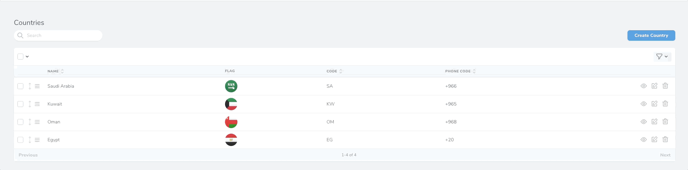

# Laravel Nova Fields Agent
[](https://github.com/MohmmedAshraf/nova-fields-agent/blob/master/LICENSE.md)
[](https://github.com/MohmmedAshraf/nova-fields-agent/issues)
[](https://packagist.org/packages/outhebox/nova-fields-agent)


## Description
This field give the ability to hide fields from your resources table on mobile screens for a better responsive concept.

## Screenshots


## Installation
This package can be installed through Composer.
```bash
composer require outhebox/nova-fields-agent
```

## Example Usage
Note: All Fields Supported "Text Field only for example".

```php
// Important !!!
use Outhebox\NovaFieldsAgent\HasNovaFieldsAgent;

class Example extends Resource
{
    use HasNovaFieldsAgent; // Important !!!

    /**
     * Get the fields displayed by the resource.
     *
     * @param  \Illuminate\Http\Request  $requestµµ
     * @return array
     */
    public function fields(Request $request)
    {
        Text::make('ExampleField')
            ->hideFromDetailOnMobile() // Hide the field from details page on Mobile
            ->hideFromDetailOnTablet() // Hide the field from details page on Tablet
            ->HideFromIndexOnMobile() // Hide the field from index on Mobile
            ->HideFromIndexOnTablet() // Hide the field from index on Tablet
            ->sortable(),
    }
}
```

## License
Laravel Nova Fields Agent is licensed under [The MIT License (MIT)](LICENSE.md) .

## Donate
If you like this package, you can show your appreciation 💜 by [donating any amount via Patreon](https://www.patreon.com/m_ashraf) to support ongoing development.
